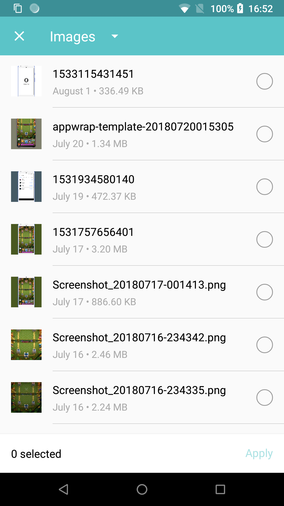
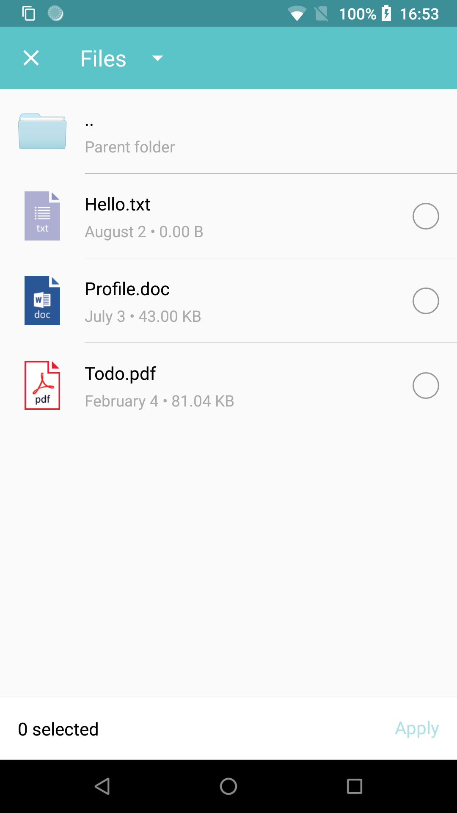

# Polaris

[](https://jitpack.io/#cn.quickits/Polaris)

Polaris is a file chooser for Android

- Use it in Activity or Fragment
- Choose All files
- Custom themes
- Custom file extension icon

|           Images            |              FileSystem              |
| :-------------------------: | :----------------------------------: |
|  |  |

## Download

- Add the JitPack repository to your build file

```gradle
allprojects {
    repositories {
        maven { url 'https://jitpack.io' }
    }
}
```

- Add the dependency

```gradle
dependencies {
    implementation 'cn.quickits:Polaris:0.2.1'
}
```

## Usage

### Permission

The library requires two permissions:

- `android.permission.READ_EXTERNAL_STORAGE`
- `android.permission.WRITE_EXTERNAL_STORAGE`

So if you are targeting Android 6.0+, you need to handle runtime permission request before next step.

### Simple Usage Snippet

Start `PolarisActivity` from current `Activity` or `Fragment`:

```kotlin
Polaris.from(this).forResult(REQUEST_CODE_CHOOSE)
```

### Receive Result

```kotlin
override fun onActivityResult(requestCode: Int, resultCode: Int, data: Intent?) {
    super.onActivityResult(requestCode, resultCode, data)
    if (requestCode == REQUEST_CODE_CHOOSE && resultCode == Activity.RESULT_OK) {
        val uris = Polaris.obtainResult(data)
        val paths = Polaris.obtainPathResult(data)
    }
}
```

## Thanks

This library is inspired by [Matisse](https://github.com/zhihu/Matisse) & [Charles](https://github.com/TonnyL/Charles) and uses some of its source code.

## License

Apache License Version 2.0

Copyright (c) 2018-present, GavinLiu
